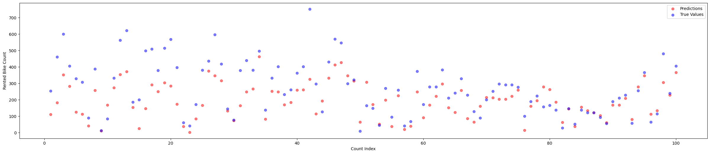

# AI_Forecast2Ride

| Nombre     | Matrícula |
| ---------- | --------- |
| Yuna Chung | A01709043 |

## Introducción

El uso de bicicletas públicas es una opción eficiente y ecológica para la movilidad en Seúl. Por la alta demanda, uno de los principales desafíos lde estos sistemass de bicicletas compartidas es garantizar la disponibilidad estable a lo largo del día, minimizando el tiempo de espera para los usuarios.

## Dataset

Este proyecto utiliza técnicas de Machine Learning para predecir la cantidad de bicicletas que se rentarán utilizando los datos de Seúl, Corea del Sur. El dataset contiene el número de bicicletas públicas rentada por hora en el sistema de distribución de bicicletas de Seúl, junto con los datos climáticos correspondientes y la información de vacaciones

### Tabla de Variables

| Nombre del Variable                               | Tipo          | Unidad |
| ------------------------------------------------- | ------------- | ------ |
| Date (Fecha)                                      | Fecha         | NA     |
| Rented Bike count (Número de Bicicletas Rentadas) | Número Entero | NA     |
| Hour (Hora)                                       | Número Entero | NA     |
| Temperature (Temperatura)                         | Continuo      | C      |
| Humidity (Humedad)                                | Número Entero | %      |
| Wind Speed (Velocidad del Viento)                 | Continuo      | m/s    |
| Visibility (Visibilidad)                          | Número Entero | 10m    |
| Dew Point Temperature (Punto de Rocío)            | Continuo      | C      |
| Solar Radiation (Radiación Solar)                 | Continuo      | Mj/M2  |
| Rainfall (Lluvias)                                | Número Entero | mm     |
| Snowfall (Nevadas)                                | Número Entero | cm     |
| Seasons (Estación)                                | Categoría     | NA     |
| Holiday (Día Festival)                            | Binario       | NA     |
| Functioning Day (Día Funcional)                   | Binario       | NA     |

### Información Adicional de Variables

- Date : year-month-day
- Rented Bike count - Count of bikes rented at each hour
- Hour - Hour of he day
- Temperature-Temperature in Celsius
- Humidity - %
- Windspeed - m/s
- Visibility - 10m
- Dew point temperature - Celsius
- Solar radiation - MJ/m2
- Rainfall - mm
- Snowfall - cm
- Seasons - Winter, Spring, Summer, Autumn
- Holiday - Holiday/No holiday
- Functional Day - NoFunc(Non Functional Hours), Fun(Functional hours)

## Preprocesamiento

### Encoding.ipynb

Para poder predecir la cantidad de bicicletas que serán rentadas de acuerdo al contexto del día, es importante que los datos que estoy utilizando sean numéricos. Por esta razón, después de verificar que no hay datos vacíos en el dataset utilicé el método de One-Hot Encoding para la columna "Seasons" y Label Encoding para las columnas "Holiday" y "Functional Day". 
Desde el paquete de `sklearn.preprocessing` importé `OneHotEncoder` para el método de One-Hot Encoder y `LabelEncoder` el método de Label Encoder. Cada método fue realizada y después, concatené los datos para exportalos en un csv.
La razón por qué utilicé One-Hot Encoding para la columna "Seasons" fue principalmente para evitar asumir el orden de los valores. Como la columna tiene 4 diferentes estaciones que no tienen tal cual una jerarquía u orden lógico entre ellas, crear una columna binara por cada estación para identificar el valor del dato fue muy efectivo evitando introducir una relación de orden falsa entre las estaciones. Por otra parte, las columnas "Holiday" y "Functional Day" utilicé el método de Label Encoding ya que estos son cateogrías con solo dos valores posibles. No hay necesidad de separar las columnas cuando los valores son binarios.

### DataSplitting.ipyb

Después de limpiar el dataset, dividí los datos para poder tener un dataset para entrenar mi modelo y otro dataset para probar mi modelo. Utilizando `random`, escogí 80% de los datos de manera aleatoria utilizando `sample` y los exporté a un nuevo csv con puros datos para entrenamiento del modelo y el 20% restante fue exportado a un nuevo csv conteniendo solamente los datos que se utilizarán para probar el modelo.

### Scaling.ipynb

Una vez que los datos ya estaban dividos para el entrenamiento y prueba, continué con el escalamiento de los datos utilizando `StandardScaler` de `sklearn.preprocessing` ya que la escala de mis datos estaban muy grandes. Primero, eliminé la columna de `Date` desde mis datos ya que las fechas eran cadenas de texto y para el escalamiento, nada más ocupo valores numéricos. 
Después, dividí los datos otra vez en `features (x)` y `target (y)`. Las caracterísicas (x) son todos esos valores que va a usar el modelo para hacer predicciones, y la variable objetivo (y) es lo que el modelo tiene que predecir lo cual es la cantidad de bicicletas rentadas. 
Ya que los datos estaban una vez más divididos, creé el escalador con `StandardScaler` de scikit-learn. Para los datos de `x_train`, utilicé `fit_transform()` para calcular la media y desviación estándar de cada columna y al final usar esos valores calculados para escalar los datos. En caso de `x_test`, solamente utilicé `transform()` para escalar los datos usando la media y desviación del entrenamiento pero sin `fit` porque eso causaría que use información del test para preparar mi modelo.
Y al final de esto, exporté los datos de entrenamiento escalados, los datos de prueba escalados, la columna de target sin escalamiento de train y test a diferentes archivos de csv.

## Modelo

### Heatmap.ipynb

Como tengo muchos features independientes, decidí evaluar la correlación entre estas categorías para visualizar la relevancia de cada uno de ellos con el target que es la cantidad de bicicletas rentadas ya que los features irrelevantes afectan la exactitud del modelo [2].
Utilicé `seaborn` y `matplotlib.pyplot` para graficar este heat map. Eliminé las columnas de índice y de fechas los cuáles consideré irrelevantes desde la fase de escalamiento de los datos, y utilicé `corr()` para obtener la correlación entre las columnas. 
Ya con los datos listos, creé un heat map rojo oscuro siendo 1, el valor más alto y el azul oscuro -1, el valor más bajo. Claramente, la hora y la temperatura fueron las columnas con más correlación con la cantidad de bicicletas rentadas.

### ModelTraining.ipynb

Utilizando `RandomForestRegressor` de `sklearn.ensemble`, entrené mi modelo con el algoritmo de **Random Forest**.
Para los datos objetivos que no están escalados, utilicé `values.ravel()` para convertir mi DataFrame en un arreglo NumPy unidimensional.
Después, creé mi modelo `RandomForestRegressor` usando scikit-learn. El parámetro `n_estimators` es para indicar el número de árboles en el bosque, y el `random_state` sirve para que mi modelo obtenga el mismo resultado siempre.
`y_pred` es el arreglo con las predicciones del modelo que se generó con los datos de prueba. Después, calculé el **Mean Absolute Error (MAE)**, **Root Mean Squared Error (RMSE)** y **R^2** usando `sklearn.metrics`. 
Mi modelo tuvo MAE de 140.97, RMSE de 233.63 y R^2 de 0.87, cuando el modelo que encontré que utiliza random forest obtuvo MAE de 121, RMSE de 210 y R de 0.9 [3]. También generé 3 gráficas utililando `matplotlib.pyplot` para ver qué tan lejos están los valores previstos de los valores actuales.
Las primeras dos gráficas muestra todos los valores, pero la última gráfica recibe una entrada por hora para que sea más fácil de visualizar la comparación, y utilicé `randint` para que el resultado de la gráfica cada vez que corres el modelo.

### NueralNetwork.ipynb

Ya que el rendimiento de mi modelo utilizando Random Forest no fue lo óptimo, intenté comparar los resultados
con un modelo de **Nueral Network**. Utilicé `tf.keras.Sequential`, con dos capas densas con la activación relu 
y una capa densa con 1 para obtener la salida numérica para el modelo de regresión. Entrené el modelo utilizando los datos de entrenamiento durante 100 épocas,
y al evaluar, obtuve el loss de 194.56 y el accuracy de 0.029. Sin embargo, como es un modelo de regresión que predice el valor de la salida de acuerdo a los valores de entrada, el accuracy no tiene mucha relevancia.
Y este modelo tuvo MAE de 194.56, RMSE de 315.91 y R^2 de 0.76.

## Resultados

### Comparación de Modelos

#### Random Forest

#### Deep Neural Network

## Referencias

[1] UCI Machine Learning Repository, “Seoul Bike Sharing Demand,” [Online]. Available: https://archive.ics.uci.edu/dataset/560/seoul+bike+sharing+demand. [Accessed: May 12, 2025].

[2] X. Lin and C. Lu, “A Stacking-Based ensemble model for prediction of metropolitan bike sharing demand,” American Journal of Information Science and Technology, Apr. 2023, doi: 10.11648/j.ajist.20230702.13.

[3] T.-T. T. Ngo, H. T. Pham, J. G. Acosta, and S. Derrible, “Predicting Bike-Sharing demand using Random Forest,” Journal of Science and Transport Technology, pp. 13–21, May 2022, doi: 10.58845/jstt.utt.2022.en.2.13-21.